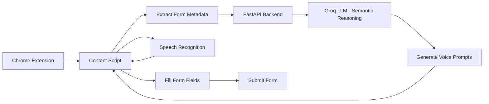

<div align="center">

# 👁️ VisAid AI
### AI-Powered Accessibility Copilot for Web Forms

[](https://python.org)
[](https://fastapi.tiangolo.com/)
[(https://developer.chrome.com/docs/extensions/)
[](https://groq.com)
[

🚀 Built for **AI for Bharat Hackathon**

</div>

---

# 🌍 The Problem

Web forms are essential to accessing digital services today.

From **government portals and scholarship applications to healthcare registrations and job forms**, users constantly interact with complex web forms.

However, for **visually impaired users**, these forms are extremely difficult to complete.

Current tools like **screen readers** only narrate what is visible on the screen.

They do not:

- understand form logic
- infer field meaning
- guide users step-by-step
- help resolve ambiguous or poorly labeled fields

As a result, visually impaired users often require **external assistance**, which compromises:

- **Privacy**
- **Independence**
- **Digital accessibility**

---

# 💡 Our Solution — VisAid AI

**VisAid AI** is an **AI-powered accessibility copilot** that enables visually impaired users to **complete web forms independently using voice interaction and document intelligence**.


## 🚀 Live Demo
- Application: [Download extension from here](https://d1j3ryjbqoah9e.cloudfront.net/)
- Video Walkthrough (3 min 40 sec): [Watch on YouTube](https://www.youtube.com/watch?v=Eom0-dATRdo&t=1s)

Instead of simply reading fields aloud, VisAid:

- understands the **semantic intent** of form fields
- guides users through forms using **voice prompts**
- extracts information from uploaded **PDF documents**
- automatically fills form fields
- allows the remaining inputs to be completed using **speech**

The goal is simple:

> **Make completing any web form as simple as having a conversation.**

---

# 🚀 Version 1 (MVP)

This repository contains **Version 1 of VisAid AI**.

The MVP focuses on solving the **core accessibility challenge**:

✔ Semantic form understanding  
✔ Voice-guided form filling  
✔ Document-based autofill  

Future versions will extend VisAid into a **full agentic accessibility platform**.

---

# ✨ MVP Features

## 🧠 Semantic Form Understanding

VisAid analyzes HTML form fields and sends metadata to an LLM to determine the **actual meaning of each field**.

Example:

Input metadata:

```
placeholder: Enter Aadhaar number
```

VisAid converts this into a spoken prompt:

```
Please say your Aadhaar number
```

---

## 🎙 Voice-Driven Form Interaction

VisAid guides the user through form completion.

Flow:

1️⃣ VisAid speaks a prompt  
2️⃣ User responds via voice  
3️⃣ VisAid fills the corresponding field automatically  

This enables **hands-free form interaction**.

---

## 📄 PDF Document Autofill

Users can upload documents containing personal information such as:

- result sheets
- certificates
- identity documents
- resumes

VisAid extracts relevant information and **automatically fills matching form fields**.

Remaining fields can then be filled through **voice commands**.

---

## 🔧 Intelligent Speech Normalization

VisAid converts spoken inputs into the correct formats.

Example:

Speech input:

```
arunima at gmail dot com
```

Converted to:

```
arunima@gmail.com
```

Speech input:

```
nine eight seven six five four three two one zero
```

Converted to:

```
9876543210
```

VisAid handles normalization for:

- email addresses
- URLs
- phone numbers
- punctuation
- numbers

---

## 📋 Smart Form Handling

VisAid automatically handles common form field types:

✔ Text inputs  
✔ Email inputs  
✔ Phone numbers  
✔ Radio buttons  
✔ Dropdown menus  
✔ Checkbox groups  
✔ Textareas  

---

## 📤 Voice-Controlled Submission

After filling all fields, VisAid asks:

```
All fields are filled. Do you want to submit the form?
```

If the user says **yes**, the form is submitted automatically.

---

# 🏗️ System Architecture



---

# 🛠 Tech Stack

| Layer | Technology | Specific Choice |
|------|------------|----------------|
Main LLM | Groq API | llama-3.3-70b-versatile |
Tooling Standard | Model Context Protocol | MCP |
Backend API | FastAPI | 0.115+ |
Frontend | Chrome Extension | Manifest V3 |
Voice Input | Web Speech API | Native Browser API |
Voice Output | ElevenLabs | Turbo v2.5 |

---

# 📁 Project Structure

```
visaid/

├── visaid-extension/
│   ├── manifest.json
│   ├── content.js
│   ├── background.js
│   └── popup.html
│
├── visaid-backend/
│   ├── main.py
│   ├── llm_service.py
│   └── requirements.txt
│
├── visaid-frontend/
│   ├── src/
│   ├── components/
│   └── package.json
│
└── README.md
```

---

# ⚙️ Installation & Setup

## 1️⃣ Clone Repository

```bash
git clone https://github.com/ArunimaSaxena164/VisAid
```

---

# Backend Setup

```
cd visaid-backend
pip install -r requirements.txt
```

Create `.env` file

```
GROQ_API_KEY=your_groq_api_key
```

Run backend server

```
uvicorn main:app --reload
```

Backend will run on

```
http://localhost:8000
```

---

# Chrome Extension Setup

1️⃣ Open Chrome

Go to

```
chrome://extensions
```

2️⃣ Enable **Developer Mode**

3️⃣ Click **Load Unpacked**

4️⃣ Select the folder:

```
visaid-extension
```

The extension will now be installed.

---

# Frontend Website (Landing Page)

The project includes a frontend website introducing VisAid AI.

Setup:

```
cd visaid-frontend
npm install
npm run dev
```

---

# 🔮 Future Vision

VisAid is designed to evolve into a **full Agentic Accessibility Platform**.

Planned capabilities:

🤖 Multi-agent reasoning system  
🌍 Multilingual voice interaction  
🧭 Voice navigation across entire websites  
📄 Resume and identity document autofill  
🛡 Intelligent error explanation  
🎯 Accessibility personalization  

---

# 🇮🇳 Impact

VisAid AI can significantly improve accessibility across:

- Government digital services
- Educational platforms
- Healthcare portals
- Employment systems

By enabling visually impaired users to complete forms independently, VisAid promotes:

✔ Digital inclusion  
✔ User privacy  
✔ Equal access to services  

---

# ❤️ Built With Purpose

VisAid AI is built on a simple belief:

> Accessibility should not be an afterthought.  
> It should be built into the foundation of digital systems.

---

<div align="center">

⭐ If you like this project, consider giving it a star!

</div>
